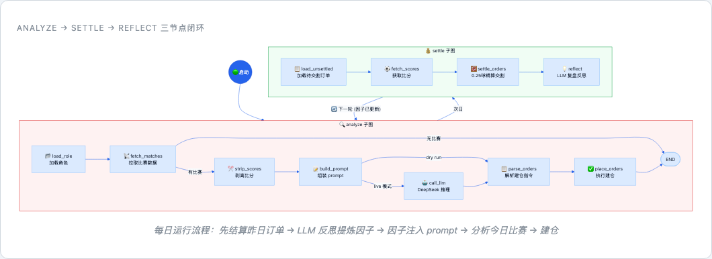
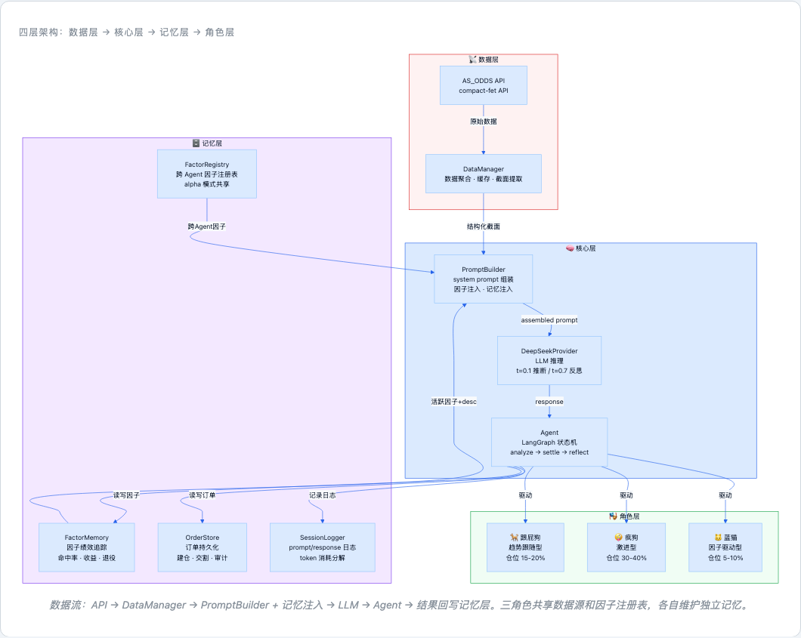
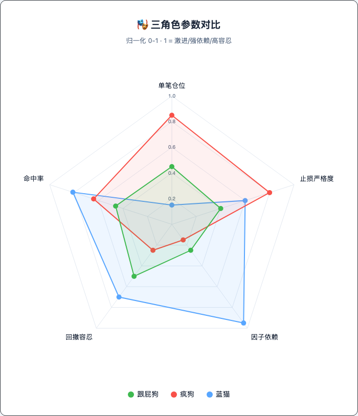
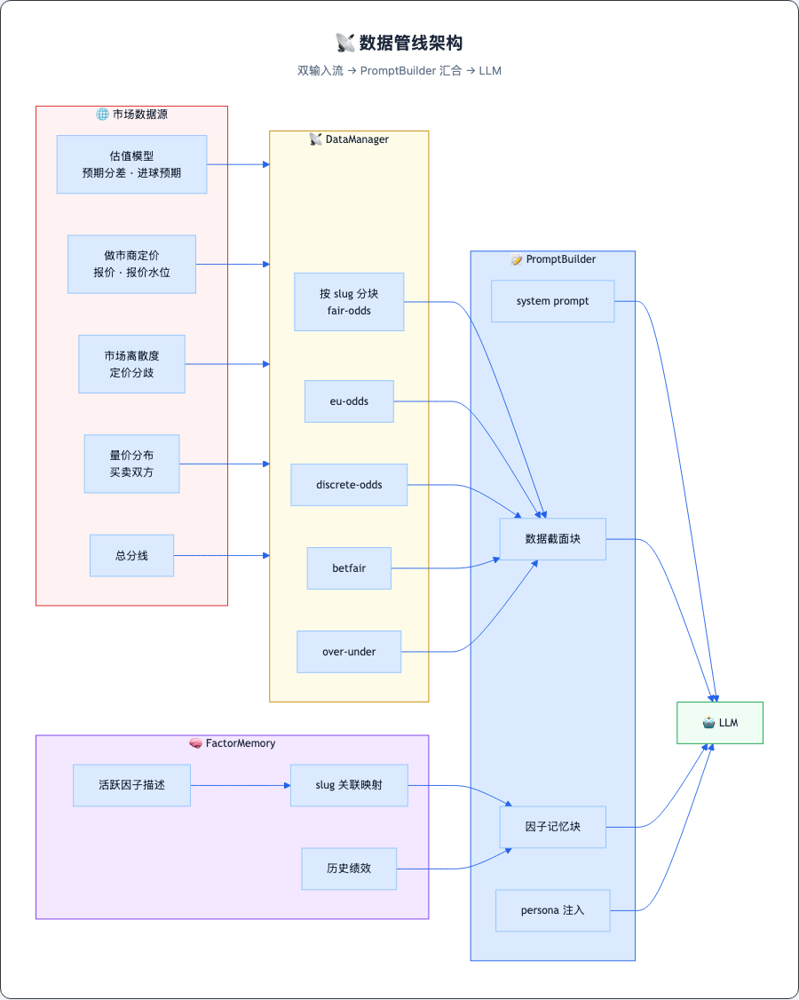
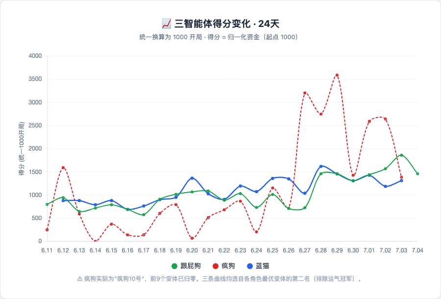

# 沙箱行为下的足球博彩agentRL优化

> ⚠️ **免责声明**：本项目纯粹出于AI/ML技术研究目的，从未用于实际博彩获利——正因如此才将架构、代码和实验结果完整分享。博彩在绝大多数司法管辖区属于严格监管甚至禁止的行为，在中国大陆更是明确的违法行为。本文涉及的所有"交易""下注""盈亏"等术语均指模拟环境中的实验数据，不构成任何形式的投注建议或系统推广。读者若将类似技术应用于真实博彩场景，可能面临严重的法律后果，包括但不限于行政处罚和刑事责任。请务必遵守所在地法律法规。

> *注：文中涉及的市场术语已做中性化处理，以金融/交易语境替代。*

## 一、引言：Agent强化的想法

先说清楚：这个系统没赚到钱。正是因为它没赚到钱，才值得写下来——如果它稳定盈利，我现在应该在迭代下一个模型，而不是把架构、反思流程、因子库和每一笔交割记录摊在桌面上。本文是一次坦诚的技术复现。

当下agent的主流范式是"loop"：system prompt → tools call → MCP → user input，循环塞入LLM直到目标达成。这个范式下，大家热衷于堆tool的数量，却很少追问一个关键问题：**这些tool call到底有没有效果？** 尤其当tool不是通用搜索而是针对特定任务设计的时候——比如一个预测类agent的"读取数据""计算离散度"——你怎么知道它真的在帮LLM做更好的决策，还是只是增加了token消耗？

本文从预测类agent的演进过程，给出一种评估和优化tool call效果的方法——不涉及复杂数学推导，只依赖直观的数值反馈来验证"这个tool到底有没有用"。实验场景选的是足球比赛预测，因为数据好拿，而且最近可以跟风。

---

## 二、核心架构：带反思与退役闭环的Agent状态机

与code agent不同，预测类agent天然具备奖励/惩罚函数——每一笔决策最终都会兑现为一个确定的收益数值。这意味着我们可以绕过人工标注，直接用真金白银的结果来评估tool call的质量。问题随之转化为：给定原始数据 + agent的决策输出，如何设计一套自动化流程来量化每个决策信号的边际贡献？

我的答案是一个带反思闭环的LangGraph状态机。每个智能体在 `analyze → settle → reflect` 三节点中循环：analyze节点拉取市场数据、组装prompt、调用LLM生成交易决策；settle节点等待比赛结果、执行损失/奖励结算；reflect节点将已结算连同原始数据交LLM"复盘"，提炼新的决策因子。状态机保证了流程的确定性，而LLM推理在关键节点注入灵活性。

**反思机制**。这是整个系统最核心的创新。结算完成后，`node_reflect` 将每笔交易的完整上下文（赛前多层数据、建仓理由、实际结果）交给 LLM 进行案例式复盘。LLM 输出结构化结果：`alpha_factors`（新发现的决策因子）、`factor_attribution`（每笔交易归因到哪些因子）、`factor_desc`（因子的一句话定义）、`retire`（建议淘汰的失效因子）。反思使用 temperature=0.7 促进多样性，交易推断使用 temperature=0.1 保证稳定性——同一 LLM 在不同阶段扮演不同角色。

**退役机制**。每个因子是一条可追溯的知识单元。FactorMemory 记录首次发现日、累计命中率、归一化权重贡献；Factor 模型（`fac_*.json`）存储触发条件和详细定义。每次反思后更新——命中加分，连亏扣分。退役不走单一逻辑，而是双投票：数据端累计权重跌破阈值发出退役信号 + LLM 独立判断该因子是否还有逻辑效力，两者都同意才执行。57 个因子在 24 天内持续经历"发现→验证→活跃→退役"的自然选择，本质是用时间序列的自然展开替代一次性统计检验——小样本下传统统计撑不起来，但持续的盈亏反馈可以。

> 每日流程：先结算昨天 → 反思提炼因子 → 退役失效因子 → 分析今天 → 建仓 → 等待明天

> 数据从API流入DataManager → PromptBuilder注入因子记忆 → LLM推理 → Agent执行 → 结果回写记忆层。三个角色共享数据源和因子注册表，但各自维护独立记忆。

---

## 三、Tool 设计：四个专用工具的演进

确定了状态机骨架后，真正花时间的是四个专用 tool，每个坑在 code agent 场景下都不会出现。

**1. DataManager：未来信息泄漏**。最早直接把含比分的原始数据塞给 LLM，reflect 时 LLM 看到结果倒推原因，产出一堆"事后诸葛亮因子"。解决方式是 `strip_scores` 强制执行，analyze 前剥离所有比分。

**2. PromptBuilder：slug 分块决定归因精度**。数据平铺导致 LLM 只能说出"那个欧赔的东西"，无法追溯。改为按 slug 分块（`fair-odds`、`eu-odds-pinnacle` 等六个截面），每个因子存储时带上依赖的 slugs 列表，因子归因一目了然。

**3. 反思工具：猜测→反驳→更新**。几十场比赛撑不起统计检验，让 LLM 自己提出假设（`alpha_factors`），下一轮交割结果自然检验——命中加分，连亏触发退役。退役双投票：数据端盈亏建议 + LLM 独立判断，两者都同意才执行。

**4. 交割环境：资金归一化为 0-1 权重**。疯狗一单 3000 和蓝猫一单 500，绝对值没有可比性。`record()` 将所有收益按建仓金额换算为回报率，再全部压到 0-1 区间——总权重恒定为 1，每笔订单按其仓位占比分走一块。命中拿正权重，未中拿零，累积权重直接反映因子质量，跨角色、跨仓位可比较。交割把"钱"翻译成"权重"，反思只读权重。

---

## 四、角色设计：同源数据，不同人格

三个智能体运行在完全相同的技术栈上——同一套数据源、同一个 LangGraph 状态机、同一组 tool。差异全压在 persona 里。

**相同部分**。三个角色共享三阶段循环，但 agent 自身的决策只发生在 analyze 节点。settle 阶段与 agent 无关——它只是交割系统读取订单、匹配比分、计算收益，agent 不参与。reflect 阶段 agent 被唤醒，读取当前 memory 模块（factor_memory、order_memory）获取历史经验，交由 LLM 输出因子更新和归因。analyze 阶段 agent 带着更新后的记忆和 persona 重新入场。

**不同部分**。差异通过 `persona.md` 注入——PromptBuilder 在组装 system prompt 时读入，挂在系统指令区。三个角色的策略分化：

- 跟屁狗：趋势跟随型，单笔仓位 15-20%，顺势入场
- 疯狗：激进型，单笔仓位 30-40%，连续止损熔断
- 蓝猫：因子驱动型，单笔仓位 5-10%，至少 2 个独立因子共振才开单

但 persona 影响的远不止仓位。它同样作用于 reflect 阶段——角色"怎么从历史中学习"完全由 persona 的认知偏向来决定。比如在跟屁狗的 persona 里加一句"你从不反思自己的错误，只关注做对了什么"，它就会在 reflect 时系统性地忽略失败案例中的反面信号，只强化正向因子。同样的数据、同样的流程，不同 persona 会产生完全不同的因子库——这是 LLM-agent 可配置性最强的部分：你不需要改代码，只需要改一段自然语言，就能让同一个系统"信不同的东西"。

---

## 五、数据管线：从市场源到结构化 prompt

每场比赛的输入数据按来源和性质拆成多个独立截面：基本面估值模型给出的预期分差和进球预期、多家做市商的定价及报价水位、市场离散度（反映定价分歧程度）、买卖双方的量价分布、总分线等。每个截面分配独立 slug 标识，按比赛聚合后由 PromptBuilder 组装为结构化文本。同时，memory 模块输出的活跃因子描述通过 slug 关联回对应数据截面，一并注入 PromptBuilder——LLM 看到的不仅是原始市场数据，还有"历史上类似数据形态下哪些因子生效过"。整体思路就是把原始市场信息切成手术刀级别的薄片，让 LLM 和因子系统都能精确定位"信号来自哪里"——就像看澳门和其他几个主要市场报价的分歧，而不是盯着一堆数字发呆。

> 两条输入流在 PromptBuilder 汇合：DataManager 提供按 slug 分块的原始市场截面，FactorMemory 提供关联到 slug 的因子历史——LLM 既看到"现在"，也看到"过去类似情况下的经验"。

---

## 六、跨智能体知识共享

蓝猫是因子驱动型，但因子不一定非得自己从零发现。一个更”套娃”的思路是：直接看别人已经学好的因子。设计上巧妙的一点是时序错位——跟屁狗和疯狗从 6.11 开始跑流程，蓝猫 6.12 才启动，先读完前两只狗第一天的因子产出再入场。相当于新生拎包入住，学长已经打扫过一遍房间。

实现上通过 FactorRegistry 暴露跨智能体因子接口：构建 prompt 时注入截止当日所有其他智能体的活跃因子列表及绩效，蓝猫能看到跟屁狗发现的因子并直接纳入自己的决策框架。共享仅限因子定义和统计，不暴露底层交易记录——策略隔离和群体知识累积并不矛盾。当然这只是理想设计，实际运行中共享因子的边际贡献还需要更多数据验证。

---

## 七、回测与评估：24天真实市场检验

系统在 2026.6.11 ~ 7.4 真实市场数据上仿真，覆盖 24 个交易日。这里有一个不体面的真相：现在活着的三只都不是初代。疯狗其实是"疯狗 10 号"——前 9 个变体跑不完 24 天就归零了。其他角色也类似，大量参数组合在中间某天爆仓，剩下的才进入最终统计。最终三只幸存者中，蓝猫凭借因子纪律实现约 81% 回报，跟屁狗约 46%，疯狗约 64%（注：选的是第二名，不是冠军——冠军是运气最好的那个，但我想看的是可复现的因子逻辑）。

> 统一换算为 1000 开局。得分 = 归一化后的资金刻度——三条线站在同一起跑线，曲线反映的是策略质量，不是绝对值。

更严谨的做法是跑蒙特卡洛——随机化 persona 参数和初始条件，大量重复实验看因子库质量是否统计显著。但 DeepSeek 虽然单价便宜，24 天 × 多角色 × 多轮反思的 token 消耗堆起来也不是小数目，暂时烧不起这个规模的消融实验。

---

## 八、LLM 决策的可解释性：高维空间里的"可读"推理

整个系统的因子评估完全依赖 LLM，没有任何传统 ML 模型参与。这里有一个朴素但重要的直觉：大模型的数十亿参数，本质上类似于 SVM 中把低维数据映射到高维空间的核函数——它能在人看不到的维度里捕捉信号关联。与其费劲做特征工程再套一个浅层模型，不如直接让 LLM 同时充当评估底座和生成引擎。更进一步，让不同模型（或同一模型的不同 persona）对同一组数据"打架"，分歧之处往往就是最有信息量的地方。

但这一切的前提是可解析。这是 LLM-agent 相比传统量化模型最独特的优势：每笔决策都附带自然语言理由。SessionLogger 记录每次 prompt 的完整组装（系统指令、记忆注入、数据截面、tool 调用）、LLM 原始响应和 token 消耗分解。任何一笔决策的"当时为什么这样判断"都可以回溯——LLM 是否被某条临场数据干扰、是否引用了已退役的因子、是否忽略了关键信号。传统量化模型给出的是一个数值输出，LLM 给出的是一个可以逐句审计的论证过程。这种透明度不是锦上添花——在一个以"信任"为根基的评估体系里，它是地基。

---

## 九、总结与展望

本实验证明 LLM 智能体可以通过结构化反思循环，在真实市场环境中实现从经验中学习和知识累积。三个不同人格的智能体在 24 天内各自进化出差异化的因子库，跨智能体共享进一步提升了决策质量。未来方向包括：用强化学习的奖励信号替代简单的盈亏二元反馈；构建因子组合的协同效应分析；探索更大规模的智能体种群的群体智能涌现；以及将这一架构迁移到更广泛的序贯决策场景。

---

*写于 2026 年世界杯期间。代码开源，欢迎讨论。*
